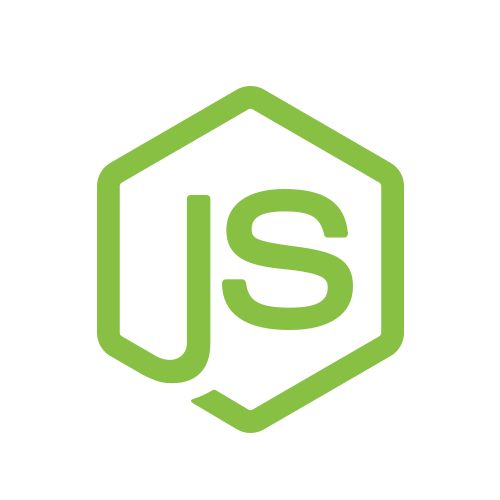

# Bem-Vindo a Documentação do Node.js

Para acessar a documentação completa acesse [nodejs.org](https://www.nodejs.org).

## Comandos Básicos

* `npm install` - Utilizado para instalar pacotes e bibliotecas.
* `npm uninstall` - Remove pacotes não utilizados.
*` npm update` - Atualiza versões de pacotes.
* `npm init` - Inicializa o npm no projeto.
* `npm start` - Executa a aplicação conforme o script start.
* `npm run` - Executa qualquer script definido no package.json.

## Layout do Projeto

O projeto em NodeJs pode ser modificado para atender a diversas particularidades, mas basicamente segue a seguinte estrutura:

    src
        app.js          # Classe app
        server.js       # Server para iniciar o app
    api             
        controllers   # Funções da controllers do express route
        models        # Modelos do banco de dados
        services      # Regras de negócio
        subscribers   # Eventos async 
        repositories* # Query builders 
    config          # Configuração das variaveis de ambiente
    jobs            # Tarefas de rotinas
    loaders         # Modulos para utilizado no app
    utils           # Trechos de código pequeno
    helpers         # Trechos de arquitetura de código
    routes          # Definição de rotas express
    types           # Tipagem (d.ts) para Typescript